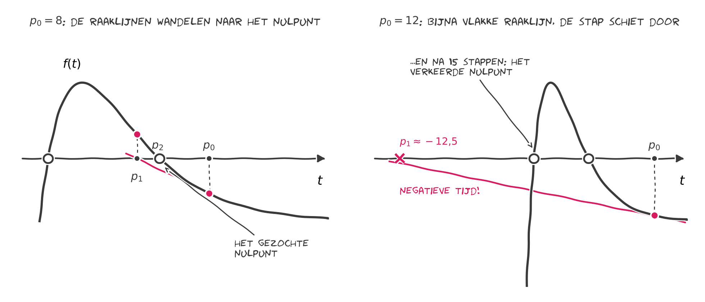

Na het innemen van een medicijn is de concentratie in het bloed

$$
C(t) = 3t\,e^{-t/2} \qquad \text{(mg per liter, $t$ in uren)}.
$$

Het medicijn werkt zolang $C(t) \ge 1$. Wanneer zakt de concentratie weer
onder de 1? We zoeken het nulpunt van $f(t) = 3t\,e^{-t/2} - 1$ rond
$t \approx 5{,}7$ uur. De code probeert drie startwaarden $p_0$.

::: {.opgave code="newton_medicijn.py"}
```{.parameters}
p0  : text                                  # de startwaarden, tussen [ ] en gescheiden door komma's
eps : 0.01 | 0.0001 | 1e-6 | 1e-10 | 1e-14   # stop als twee stappen zo dicht bij elkaar liggen
```
:::

{fig-alt="De grafiek van f met de raaklijnstappen van Newton-Raphson, vanaf p0 = 8 en vanaf p0 = 12."}

::: {.probeer}
## Probeer zelf

1. Typ `[20]` in het tekstvak bij `p0` en druk op Enter. Waar komt de eerste
   stap terecht? Hoe snel komt de methode daarna terug?
2. Probeer nu `[22]`. Lees de foutmelding: welk getal is te groot geworden
   voor de computer?
3. Voor welke startwaarden vindt Newton-Raphson het nulpunt bij 5,67? Probeer
   bijvoorbeeld `[2.5, 3, 4, 9, 9.5, 10]`.
4. Welke startwaarden geven het andere nulpunt, bij 0,41? Wat betekent dat
   nulpunt voor het medicijn?
5. Bekijk dezelfde stappen als grafiek in
   [Newton-Raphson in beeld](h4-grafiek.qmd), waar je de startwaarde met een
   schuifje kiest.
:::

::: {.callout-tip collapse="true"}
## Wat valt op?

Drie totaal verschillende uitkomsten!

- $p_0 = 6$: klaar in 4 stappen. Newton-Raphson op zijn best.
- $p_0 = 2$: dat is precies de top van $C(t)$, waar $f'(p_0) = 0$. De raaklijn
  ligt horizontaal en snijdt de $t$-as nooit; de methode loopt meteen vast.
- $p_0 = 12$: in de vlakke staart is de raaklijn bijna horizontaal. De eerste
  stap schiet door naar $t \approx -12{,}5$ (negatieve tijd!), en na een lange
  omzwerving komt de methode uit bij het *verkeerde* nulpunt $t \approx 0{,}41$:
  het moment waarop het medicijn begint te werken, niet waarop het is
  uitgewerkt.
:::
